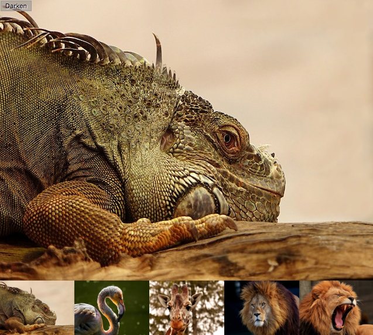
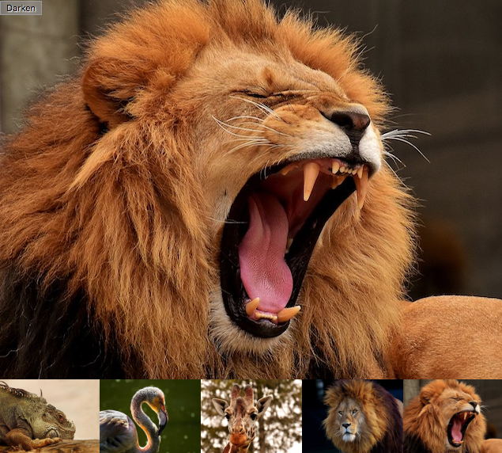

# Photo Gallery 

[Link to gallery](https://coffeina.github.io/Photo.Gallery/)
<p align="center">
  
</p>

## Looping through images:

```javascript
for (var i = 1; i <= 5; i++) {
    var newImage = document.createElement('img');
    newImage.setAttribute('src', 'images/pic' + i + '.jpg');
    thumbBar.appendChild(newImage);
    newImage.onclick = function(e) {
        var imgSrc = e.target.getAttribute('src');
        displayImage(imgSrc);
    }
}
```
<p align="center">
    
</p>

##  Wiring up the Darken/Lighten button

```javascript
btn.onclick = function() {
    var btnClass = btn.getAttribute('class');
    if (btnClass === 'dark') {
        btn.setAttribute('class', 'light');
        btn.textContent = 'Lighten';
        overlay.style.backgroundColor = 'rgba(0,0,0,0.5)';
    } else {
        btn.setAttribute('class', 'dark');
        btn.textContent = 'Darken';
        overlay.style.backgroundColor = 'rgba(0,0,0,0)';
    }
}
```

<p align="center">
    
</p>


## License

`Photo.Gallery` is available under the MIT license.